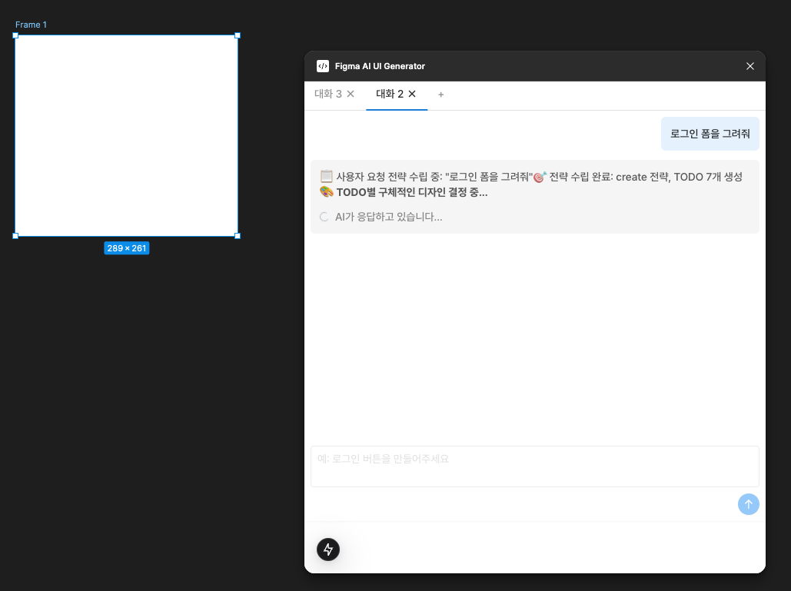
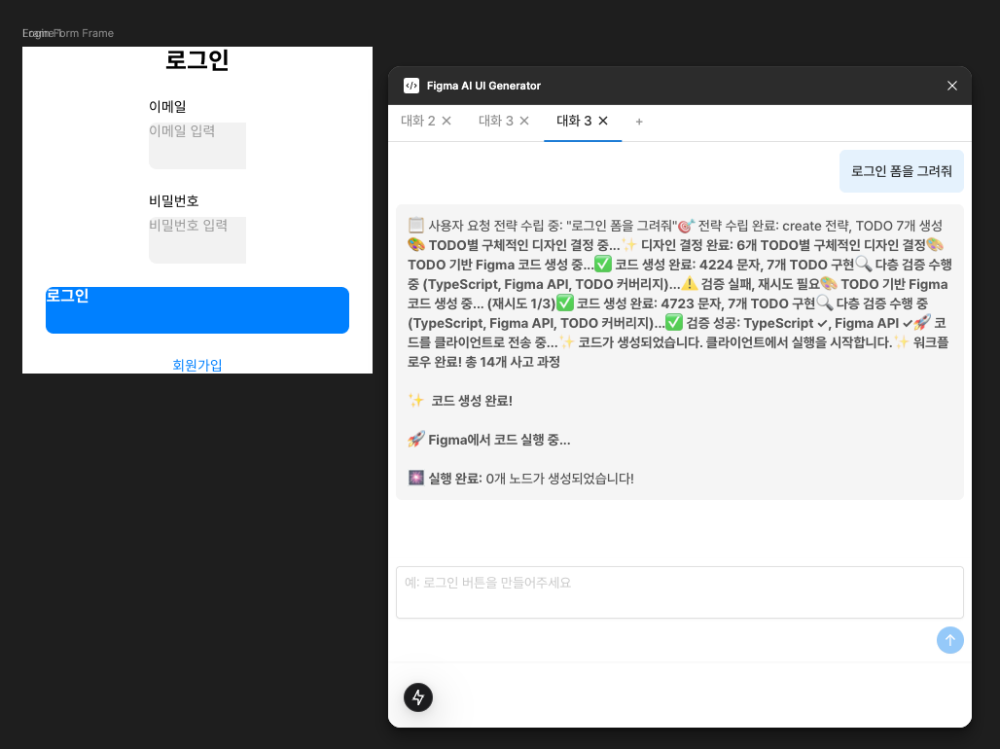

# Figma AI Design Generator

AI를 활용하여 Figma 디자인을 자연어 명령으로 생성하고 수정하는 플러그인입니다.

<div align="center">
  
  <p><em>자연어 명령으로 디자인 생성 중</em></p>
</div>

<div align="center">
  
  <p><em>생성된 로그인 폼 디자인 - 디자인 시스템 제거 버전 </em></p>
</div>

## 개요

"로그인 폼을 그려줘"와 같은 자연어 명령을 입력하면, AI가 TODO 기반 워크플로우를 통해 Figma 디자인을 자동으로 생성합니다.

### 주요 기능

- **자연어 기반 디자인 생성**: 한국어/영어로 디자인 요청
- **TODO 기반 워크플로우**: Planning → Design → Generate → Validate → Execute
- **스마트 코드 검증**: TypeScript 및 Figma API 검증
- **자동 재시도**: 실패 시 학습 기반 재생성
- **멀티 탭 대화**: 여러 대화를 동시에 관리

## 프로젝트 구조

```
figma-ai-design-generator/
├── apps/
│   ├── claude-code-figma/     # Next.js AI 워크플로우 앱
│   │   ├── app/               # Next.js App Router
│   │   ├── components/        # React 컴포넌트
│   │   ├── hooks/             # 커스텀 훅
│   │   └── lib/
│   │       ├── ai/            # Claude AI 클라이언트
│   │       ├── figma/         # Figma 컨텍스트 처리
│   │       ├── prompts/       # AI 프롬프트 템플릿
│   │       ├── services/      # TypeScript 검증 서비스
│   │       └── workflows/     # LangGraph 워크플로우
│   │
│   └── figma-plugin/          # Figma 플러그인
│       ├── src/
│       │   ├── code.ts        # 플러그인 메인 코드
│       │   ├── functions/     # Figma API 헬퍼 함수
│       │   ├── services/      # Figma Bridge 서비스
│       │   └── ui/            # 플러그인 UI (React)
│       └── manifest.json      # 플러그인 매니페스트
│
├── images/                    # 스크린샷
├── package.json               # 루트 패키지
└── README.md
```

## 기술 스택

| 영역 | 기술 |
|------|------|
| AI | Claude 4.5 Haiku (Anthropic SDK) |
| 워크플로우 | LangGraph |
| 웹 앱 | Next.js 15, React 19, TailwindCSS |
| 플러그인 | Figma Plugin API, Vite |
| 언어 | TypeScript |
| 패키지 매니저 | pnpm |

## 시작하기

### 사전 요구사항

- Node.js 18+
- pnpm
- Figma 데스크톱 앱
- Anthropic API 키

### 설치

```bash
# 저장소 클론
git clone https://github.com/your-username/figma-ai-design-generator.git
cd figma-ai-design-generator

# 의존성 설치
pnpm install
```

### 환경 설정

```bash
# apps/claude-code-figma/.env.local 생성
cd apps/claude-code-figma
cp .env.example .env.local
```

`.env.local` 파일에 API 키 설정:

```env
NEXT_ANTHROPIC_API_KEY=your_anthropic_api_key
```

### 실행

**1. Next.js 앱 실행:**

```bash
cd apps/claude-code-figma
pnpm dev
```

**2. Figma 플러그인 빌드:**

```bash
cd apps/figma-plugin
pnpm build
pnpm build:ui
```

**3. Figma에서 플러그인 로드:**

1. Figma 데스크톱 앱 열기
2. Plugins → Development → Import plugin from manifest...
3. `apps/figma-plugin/manifest.json` 선택

## 워크플로우

AI 디자인 생성은 다음 단계를 거칩니다:

```
1. Product Blueprint  → 제품 블루프린트 생성
2. Planning          → 전략 수립 및 TODO 리스트 생성
3. Figma Design      → TODO별 구체적인 디자인 결정
4. Generate          → Figma API 코드 생성
5. Validate          → TypeScript/Figma API 검증
6. Execute           → Figma에서 코드 실행
7. Verify            → TODO 완료 검증
```

검증 실패 시 자동으로 학습하여 재시도합니다.

## 사용 예시

```
"로그인 폼을 그려줘"
"버튼 색상을 파란색으로 변경해줘"
"헤더에 로고를 추가해줘"
"카드 레이아웃을 3열로 만들어줘"
```

## 실행 로그

```
🚀 [Figma Generate Code API] Starting workflow with: {
  userMessage: '로그인 폼을 그려줘',
  hasFigmaContext: true,
  hasPreviousError: false
}
📝 TODO List:
 1. [create] 로그인 폼 프레임 생성 (너비 360px, 높이 480px)
2. [create] 로그인 타이틀 텍스트 추가
3. [create] 이메일 입력 필드 생성
4. [create] 비밀번호 입력 필드 생성
5. [create] 로그인 버튼 생성
6. [create] 회원가입 링크 추가
7. [style] 컴포넌트 간 간격 및 정렬 조정
========= plan {
  intent: '새로운 로그인 폼 디자인 생성',
  strategy: 'create',
  confidence: 0.95,
  scope: {
    targetNodes: [],
    newComponents: [ '로그인 컨테이너', '이메일 입력 필드', '비밀번호 입력 필드', '로그인 버튼', '회원가입 링크' ]
  },
  todoList: [
    {
      id: 'todo_1',
      order: 1,
      task: '로그인 폼 프레임 생성 (너비 360px, 높이 480px)',
      type: 'create',
      target: 'Login Form Frame',
      dependencies: []
    },
    {
      id: 'todo_2',
      order: 2,
      task: '로그인 타이틀 텍스트 추가',
      type: 'create',
      target: 'Login Title',
      dependencies: [Array]
    },
    {
      id: 'todo_3',
      order: 3,
      task: '이메일 입력 필드 생성',
      type: 'create',
      target: 'Email Input',
      dependencies: [Array]
    },
    {
      id: 'todo_4',
      order: 4,
      task: '비밀번호 입력 필드 생성',
      type: 'create',
      target: 'Password Input',
      dependencies: [Array]
    },
    {
      id: 'todo_5',
      order: 5,
      task: '로그인 버튼 생성',
      type: 'create',
      target: 'Login Button',
      dependencies: [Array]
    },
    {
      id: 'todo_6',
      order: 6,
      task: '회원가입 링크 추가',
      type: 'create',
      target: 'Sign Up Link',
      dependencies: [Array]
    },
    {
      id: 'todo_7',
      order: 7,
      task: '컴포넌트 간 간격 및 정렬 조정',
      type: 'style',
      target: 'Login Form Frame',
      dependencies: [Array]
    }
  ]
}
🎨 Design Result: {
  todoDesigns: 6,
  designSystemComponents: undefined,
  customElements: 6,
  complexityScore: 8,
  executionOrder: [ 'todo_1', 'todo_2', 'todo_3', 'todo_4', 'todo_5', 'todo_6' ]
}
========= design {
  "todoDesigns": [
    {
      "todoId": "todo_1",
      "task": "로그인 폼 프레임 생성",
      "design": {
        "nodeType": "FRAME",
        "nodeName": "Login Form Frame",
        "layout": {
          "layoutMode": "VERTICAL",
          "layoutSizingHorizontal": "FIXED",
          "layoutSizingVertical": "HUG",
          "primaryAxisAlignItems": "CENTER",
          "counterAxisAlignItems": "CENTER",
          "itemSpacing": 24,
          "paddingTop": 40,
          "paddingRight": 32,
          "paddingBottom": 40,
          "paddingLeft": 32,
          "width": 360,
          "height": 480,
          "backgroundColor": "#FFFFFF",
          "borderRadius": 12,
          "effects": [
            {
              "type": "DROP_SHADOW",
              "color": "rgba(0,0,0,0.1)",
              "offset": {
                "x": 0,
                "y": 4
              },
              "radius": 12
            }
          ]
        }
      }
    },
    {
      "todoId": "todo_2",
      "task": "로그인 타이틀 텍스트 추가",
      "design": {
        "nodeType": "TEXT",
        "nodeName": "Login Title",
        "textContent": "로그인",
        "parent": {
          "todoId": "todo_1",
          "insertIndex": 0
        },
        "textStyle": {
          "fontFamily": "Pretendard",
          "fontSize": 24,
          "fontWeight": 700,
          "color": "#000000",
          "textAlign": "CENTER"
        }
      }
    },
    {
      "todoId": "todo_3",
      "task": "이메일 입력 필드 생성",
      "design": {
        "nodeType": "FRAME",
        "nodeName": "Email Input Container",
        "parent": {
          "todoId": "todo_1",
          "insertIndex": 1
        },
        "layout": {
          "layoutMode": "VERTICAL",
          "layoutSizingHorizontal": "FILL",
          "itemSpacing": 8
        },
        "children": [
          {
            "nodeType": "TEXT",
            "nodeName": "Email Label",
            "textContent": "이메일",
            "textStyle": {
              "fontSize": 14,
              "fontWeight": 500,
              "color": "#333333"
            }
          },
          {
            "nodeType": "FRAME",
            "nodeName": "Email Input",
            "layout": {
              "layoutMode": "HORIZONTAL",
              "layoutSizingHorizontal": "FILL",
              "paddingTop": 12,
              "paddingRight": 16,
              "paddingBottom": 12,
              "paddingLeft": 16
            },
            "backgroundColor": "#F5F5F5",
            "borderRadius": 8,
            "borderWidth": 1,
            "borderColor": "#E0E0E0"
          }
        ]
      }
    },
    {
      "todoId": "todo_4",
      "task": "비밀번호 입력 필드 생성",
      "design": {
        "nodeType": "FRAME",
        "nodeName": "Password Input Container",
        "parent": {
          "todoId": "todo_1",
          "insertIndex": 2
        },
        "layout": {
          "layoutMode": "VERTICAL",
          "layoutSizingHorizontal": "FILL",
          "itemSpacing": 8
        },
        "children": [
          {
            "nodeType": "TEXT",
            "nodeName": "Password Label",
            "textContent": "비밀번호",
            "textStyle": {
              "fontSize": 14,
              "fontWeight": 500,
              "color": "#333333"
            }
          },
          {
            "nodeType": "FRAME",
            "nodeName": "Password Input",
            "layout": {
              "layoutMode": "HORIZONTAL",
              "layoutSizingHorizontal": "FILL",
              "paddingTop": 12,
              "paddingRight": 16,
              "paddingBottom": 12,
              "paddingLeft": 16
            },
            "backgroundColor": "#F5F5F5",
            "borderRadius": 8,
            "borderWidth": 1,
            "borderColor": "#E0E0E0"
          }
        ]
      }
    },
    {
      "todoId": "todo_5",
      "task": "로그인 버튼 생성",
      "design": {
        "nodeType": "FRAME",
        "nodeName": "Login Button",
        "parent": {
          "todoId": "todo_1",
          "insertIndex": 3
        },
        "layout": {
          "layoutMode": "HORIZONTAL",
          "layoutSizingHorizontal": "FILL",
          "paddingTop": 16,
          "paddingBottom": 16
        },
        "backgroundColor": "#4285F4",
        "borderRadius": 8,
        "textContent": "로그인",
        "textStyle": {
          "color": "#FFFFFF",
          "fontSize": 16,
          "fontWeight": 600,
          "textAlign": "CENTER"
        }
      }
    },
    {
      "todoId": "todo_6",
      "task": "회원가입 링크 추가",
      "design": {
        "nodeType": "TEXT",
        "nodeName": "Sign Up Link",
        "parent": {
          "todoId": "todo_1",
          "insertIndex": 4
        },
        "textContent": "회원가입",
        "textStyle": {
          "color": "#4285F4",
          "fontSize": 14,
          "textDecoration": "UNDERLINE"
        }
      }
    }
  ],
  "metadata": {
    "customElements": 6,
    "complexityScore": 8,
    "estimatedRenderTime": 1200
  },
  "dependencies": {
    "executionOrder": [
      "todo_1",
      "todo_2",
      "todo_3",
      "todo_4",
      "todo_5",
      "todo_6"
    ],
    "parentChildMap": {}
  }
}
null learning
const createLoginForm = async () => {
  // TODO_1: START - 로그인 폼 프레임 생성
  const loginFormFrame = figma.createFrame();
  loginFormFrame.name = "Login Form Frame";
  loginFormFrame.resize(360, 480);
  loginFormFrame.layoutMode = "VERTICAL";
  loginFormFrame.primaryAxisAlignItems = "CENTER";
  loginFormFrame.counterAxisAlignItems = "CENTER";
  loginFormFrame.itemSpacing = 24;
  loginFormFrame.fills = [{ type: 'SOLID', color: { r: 1, g: 1, b: 1 } }];
  // TODO_1: END

  // TODO_2: START - 로그인 타이틀 텍스트 추가
  const loginTitle = figma.createText();
  await figma.loadFontAsync(loginTitle.fontName);
  loginTitle.name = "Login Title";
  loginTitle.characters = "로그인";
  loginTitle.fontSize = 24;
  loginTitle.textAlignHorizontal = "CENTER";
  loginFormFrame.appendChild(loginTitle);
  // TODO_2: END

  // TODO_3: START - 이메일 입력 필드 생성
  const emailInputContainer = figma.createFrame();
  emailInputContainer.name = "Email Input Container";
  emailInputContainer.layoutMode = "VERTICAL";
  emailInputContainer.itemSpacing = 8;
  
  const emailLabel = figma.createText();
  await figma.loadFontAsync(emailLabel.fontName);
  emailLabel.characters = "이메일";
  emailLabel.fontSize = 14;

  const emailInput = figma.createFrame();
  emailInput.name = "Email Input";
  emailInput.resize(312, 48);
  emailInput.fills = [{ type: 'SOLID', color: { r: 0.95, g: 0.95, b: 0.95 } }];
  emailInput.cornerRadius = 8;

  const emailPlaceholder = figma.createText();
  await figma.loadFontAsync(emailPlaceholder.fontName);
  emailPlaceholder.characters = "이메일 입력";
  emailPlaceholder.fontSize = 16;
  emailPlaceholder.fills = [{ type: 'SOLID', color: { r: 0.6, g: 0.6, b: 0.6 } }];

  emailInput.appendChild(emailPlaceholder);
  emailInputContainer.appendChild(emailLabel);
  emailInputContainer.appendChild(emailInput);
  loginFormFrame.appendChild(emailInputContainer);
  // TODO_3: END

  // TODO_4: START - 비밀번호 입력 필드 생성
  const passwordInputContainer = figma.createFrame();
  passwordInputContainer.name = "Password Input Container";
  passwordInputContainer.layoutMode = "VERTICAL";
  passwordInputContainer.itemSpacing = 8;
  
  const passwordLabel = figma.createText();
  await figma.loadFontAsync(passwordLabel.fontName);
  passwordLabel.characters = "비밀번호";
  passwordLabel.fontSize = 14;

  const passwordInput = figma.createFrame();
  passwordInput.name = "Password Input";
  passwordInput.resize(312, 48);
  passwordInput.fills = [{ type: 'SOLID', color: { r: 0.95, g: 0.95, b: 0.95 } }];
  passwordInput.cornerRadius = 8;

  const passwordPlaceholder = figma.createText();
  await figma.loadFontAsync(passwordPlaceholder.fontName);
  passwordPlaceholder.characters = "비밀번호 입력";
  passwordPlaceholder.fontSize = 16;
  passwordPlaceholder.fills = [{ type: 'SOLID', color: { r: 0.6, g: 0.6, b: 0.6 } }];

  passwordInput.appendChild(passwordPlaceholder);
  passwordInputContainer.appendChild(passwordLabel);
  passwordInputContainer.appendChild(passwordInput);
  loginFormFrame.appendChild(passwordInputContainer);
  // TODO_4: END

  // TODO_5: START - 로그인 버튼 생성
  const loginButton = figma.createFrame();
  loginButton.name = "Login Button";
  loginButton.resize(312, 48);
  loginButton.layoutMode = "HORIZONTAL";
  loginButton.primaryAxisAlignItems = "CENTER";
  loginButton.counterAxisAlignItems = "CENTER";
  loginButton.fills = [{ type: 'SOLID', color: { r: 0.2, g: 0.4, b: 0.8 } }];
  loginButton.cornerRadius = 8;

  const loginButtonText = figma.createText();
  await figma.loadFontAsync(loginButtonText.fontName);
  loginButtonText.characters = "로그인";
  loginButtonText.fontSize = 16;
  loginButtonText.fills = [{ type: 'SOLID', color: { r: 1, g: 1, b: 1 } }];

  loginButton.appendChild(loginButtonText);
  loginFormFrame.appendChild(loginButton);
  // TODO_5: END

  // TODO_6: START - 회원가입 링크 추가
  const signUpLink = figma.createText();
  await figma.loadFontAsync(signUpLink.fontName);
  signUpLink.name = "Sign Up Link";
  signUpLink.characters = "회원가입";
  signUpLink.fontSize = 14;
  signUpLink.fills = [{ type: 'SOLID', color: { r: 0.2, g: 0.4, b: 0.8 } }];
  
  loginFormFrame.appendChild(signUpLink);
  // TODO_6: END

  // 현재 페이지에 추가
  figma.currentPage.appendChild(loginFormFrame);
};

// 플러그인 실행
createLoginForm(); figmaCode
🎯 Generated Code Info: { length: 4224, todos: 7, implementedTodos: 7 }
{
  success: false,
  errors: [
    {
      type: 'TYPE_ERROR',
      message: "Argument of type 'unique symbol | FontName' is not assignable to parameter of type 'FontName'.\n" +
        "  Type 'typeof figma.mixed' is not assignable to type 'FontName'.",
      line: 15,
      suggestion: 'Check type compatibility with Figma API interfaces',
      code: '  const loginTitle = figma.createText();\n' +
        '  await figma.loadFontAsync(loginTitle.fontName);\n' +
        '  loginTitle.name = "Login Title";'
    },
    {
      type: 'TYPE_ERROR',
      message: "Argument of type 'unique symbol | FontName' is not assignable to parameter of type 'FontName'.\n" +
        "  Type 'typeof figma.mixed' is not assignable to type 'FontName'.",
      line: 30,
      suggestion: 'Check type compatibility with Figma API interfaces',
      code: '  const emailLabel = figma.createText();\n' +
        '  await figma.loadFontAsync(emailLabel.fontName);\n' +
        '  emailLabel.characters = "이메일";'
    },
    {
      type: 'TYPE_ERROR',
      message: "Argument of type 'unique symbol | FontName' is not assignable to parameter of type 'FontName'.\n" +
        "  Type 'typeof figma.mixed' is not assignable to type 'FontName'.",
      line: 41,
      suggestion: 'Check type compatibility with Figma API interfaces',
      code: '  const emailPlaceholder = figma.createText();\n' +
        '  await figma.loadFontAsync(emailPlaceholder.fontName);\n' +
        '  emailPlaceholder.characters = "이메일 입력";'
    },
    {
      type: 'TYPE_ERROR',
      message: "Argument of type 'unique symbol | FontName' is not assignable to parameter of type 'FontName'.\n" +
        "  Type 'typeof figma.mixed' is not assignable to type 'FontName'.",
      line: 59,
      suggestion: 'Check type compatibility with Figma API interfaces',
      code: '  const passwordLabel = figma.createText();\n' +
        '  await figma.loadFontAsync(passwordLabel.fontName);\n' +
        '  passwordLabel.characters = "비밀번호";'
    },
    {
      type: 'TYPE_ERROR',
      message: "Argument of type 'unique symbol | FontName' is not assignable to parameter of type 'FontName'.\n" +
        "  Type 'typeof figma.mixed' is not assignable to type 'FontName'.",
      line: 70,
      suggestion: 'Check type compatibility with Figma API interfaces',
      code: '  const passwordPlaceholder = figma.createText();\n' +
        '  await figma.loadFontAsync(passwordPlaceholder.fontName);\n' +
        '  passwordPlaceholder.characters = "비밀번호 입력";'
    },
    {
      type: 'TYPE_ERROR',
      message: "Argument of type 'unique symbol | FontName' is not assignable to parameter of type 'FontName'.\n" +
        "  Type 'typeof figma.mixed' is not assignable to type 'FontName'.",
      line: 92,
      suggestion: 'Check type compatibility with Figma API interfaces',
      code: '  const loginButtonText = figma.createText();\n' +
        '  await figma.loadFontAsync(loginButtonText.fontName);\n' +
        '  loginButtonText.characters = "로그인";'
    },
    {
      type: 'TYPE_ERROR',
      message: "Argument of type 'unique symbol | FontName' is not assignable to parameter of type 'FontName'.\n" +
        "  Type 'typeof figma.mixed' is not assignable to type 'FontName'.",
      line: 103,
      suggestion: 'Check type compatibility with Figma API interfaces',
      code: '  const signUpLink = figma.createText();\n' +
        '  await figma.loadFontAsync(signUpLink.fontName);\n' +
        '  signUpLink.name = "Sign Up Link";'
    }
  ],
  warnings: [],
  learningContext: '=== 코드 검증 결과 ===\n' +
    '\n' +
    '❌ 에러 발견:\n' +
    '\n' +
    '1. TYPE_ERROR (15번 줄)\n' +
    "   문제: Argument of type 'unique symbol | FontName' is not assignable to parameter of type 'FontName'.\n" +
    "  Type 'typeof figma.mixed' is not assignable to type 'FontName'.\n" +
    '   해결방법: Check type compatibility with Figma API interfaces\n' +
    '   코드:   const loginTitle = figma.createText();\n' +
    '  await figma.loadFontAsync(loginTitle.fontName);\n' +
    '  loginTitle.name = "Login Title";\n' +
    '\n' +
    '2. TYPE_ERROR (30번 줄)\n' +
    "   문제: Argument of type 'unique symbol | FontName' is not assignable to parameter of type 'FontName'.\n" +
    "  Type 'typeof figma.mixed' is not assignable to type 'FontName'.\n" +
    '   해결방법: Check type compatibility with Figma API interfaces\n' +
    '   코드:   const emailLabel = figma.createText();\n' +
    '  await figma.loadFontAsync(emailLabel.fontName);\n' +
    '  emailLabel.characters = "이메일";\n' +
    '\n' +
    '3. TYPE_ERROR (41번 줄)\n' +
    "   문제: Argument of type 'unique symbol | FontName' is not assignable to parameter of type 'FontName'.\n" +
    "  Type 'typeof figma.mixed' is not assignable to type 'FontName'.\n" +
    '   해결방법: Check type compatibility with Figma API interfaces\n' +
    '   코드:   const emailPlaceholder = figma.createText();\n' +
    '  await figma.loadFontAsync(emailPlaceholder.fontName);\n' +
    '  emailPlaceholder.characters = "이메일 입력";\n' +
    '\n' +
    '4. TYPE_ERROR (59번 줄)\n' +
    "   문제: Argument of type 'unique symbol | FontName' is not assignable to parameter of type 'FontName'.\n" +
    "  Type 'typeof figma.mixed' is not assignable to type 'FontName'.\n" +
    '   해결방법: Check type compatibility with Figma API interfaces\n' +
    '   코드:   const passwordLabel = figma.createText();\n' +
    '  await figma.loadFontAsync(passwordLabel.fontName);\n' +
    '  passwordLabel.characters = "비밀번호";\n' +
    '\n' +
    '5. TYPE_ERROR (70번 줄)\n' +
    "   문제: Argument of type 'unique symbol | FontName' is not assignable to parameter of type 'FontName'.\n" +
    "  Type 'typeof figma.mixed' is not assignable to type 'FontName'.\n" +
    '   해결방법: Check type compatibility with Figma API interfaces\n' +
    '   코드:   const passwordPlaceholder = figma.createText();\n' +
    '  await figma.loadFontAsync(passwordPlaceholder.fontName);\n' +
    '  passwordPlaceholder.characters = "비밀번호 입력";\n' +
    '\n' +
    '6. TYPE_ERROR (92번 줄)\n' +
    "   문제: Argument of type 'unique symbol | FontName' is not assignable to parameter of type 'FontName'.\n" +
    "  Type 'typeof figma.mixed' is not assignable to type 'FontName'.\n" +
    '   해결방법: Check type compatibility with Figma API interfaces\n' +
    '   코드:   const loginButtonText = figma.createText();\n' +
    '  await figma.loadFontAsync(loginButtonText.fontName);\n' +
    '  loginButtonText.characters = "로그인";\n' +
    '\n' +
    '7. TYPE_ERROR (103번 줄)\n' +
    "   문제: Argument of type 'unique symbol | FontName' is not assignable to parameter of type 'FontName'.\n" +
    "  Type 'typeof figma.mixed' is not assignable to type 'FontName'.\n" +
    '   해결방법: Check type compatibility with Figma API interfaces\n' +
    '   코드:   const signUpLink = figma.createText();\n' +
    '  await figma.loadFontAsync(signUpLink.fontName);\n' +
    '  signUpLink.name = "Sign Up Link";\n' +
    '\n' +
    '위 문제들을 모두 수정하여 다시 코드를 생성해주세요.\n' +
    '특히 async/await 사용, 변수 할당, 타입 호환성에 주의하세요.'
} tsValidation
🔍 Validation Results: {
  typescript: false,
  figmaApiValid: true,
  figmaApiInvalid: 0,
  isValid: false,
  recommendation: 'retry'
}
=== 코드 검증 결과 ===

❌ 에러 발견:

1. TYPE_ERROR (15번 줄)
   문제: Argument of type 'unique symbol | FontName' is not assignable to parameter of type 'FontName'.
  Type 'typeof figma.mixed' is not assignable to type 'FontName'.
   해결방법: Check type compatibility with Figma API interfaces
   코드:   const loginTitle = figma.createText();
  await figma.loadFontAsync(loginTitle.fontName);
  loginTitle.name = "Login Title";

2. TYPE_ERROR (30번 줄)
   문제: Argument of type 'unique symbol | FontName' is not assignable to parameter of type 'FontName'.
  Type 'typeof figma.mixed' is not assignable to type 'FontName'.
   해결방법: Check type compatibility with Figma API interfaces
   코드:   const emailLabel = figma.createText();
  await figma.loadFontAsync(emailLabel.fontName);
  emailLabel.characters = "이메일";

3. TYPE_ERROR (41번 줄)
   문제: Argument of type 'unique symbol | FontName' is not assignable to parameter of type 'FontName'.
  Type 'typeof figma.mixed' is not assignable to type 'FontName'.
   해결방법: Check type compatibility with Figma API interfaces
   코드:   const emailPlaceholder = figma.createText();
  await figma.loadFontAsync(emailPlaceholder.fontName);
  emailPlaceholder.characters = "이메일 입력";

4. TYPE_ERROR (59번 줄)
   문제: Argument of type 'unique symbol | FontName' is not assignable to parameter of type 'FontName'.
  Type 'typeof figma.mixed' is not assignable to type 'FontName'.
   해결방법: Check type compatibility with Figma API interfaces
   코드:   const passwordLabel = figma.createText();
  await figma.loadFontAsync(passwordLabel.fontName);
  passwordLabel.characters = "비밀번호";

5. TYPE_ERROR (70번 줄)
   문제: Argument of type 'unique symbol | FontName' is not assignable to parameter of type 'FontName'.
  Type 'typeof figma.mixed' is not assignable to type 'FontName'.
   해결방법: Check type compatibility with Figma API interfaces
   코드:   const passwordPlaceholder = figma.createText();
  await figma.loadFontAsync(passwordPlaceholder.fontName);
  passwordPlaceholder.characters = "비밀번호 입력";

6. TYPE_ERROR (92번 줄)
   문제: Argument of type 'unique symbol | FontName' is not assignable to parameter of type 'FontName'.
  Type 'typeof figma.mixed' is not assignable to type 'FontName'.
   해결방법: Check type compatibility with Figma API interfaces
   코드:   const loginButtonText = figma.createText();
  await figma.loadFontAsync(loginButtonText.fontName);
  loginButtonText.characters = "로그인";

7. TYPE_ERROR (103번 줄)
   문제: Argument of type 'unique symbol | FontName' is not assignable to parameter of type 'FontName'.
  Type 'typeof figma.mixed' is not assignable to type 'FontName'.
   해결방법: Check type compatibility with Figma API interfaces
   코드:   const signUpLink = figma.createText();
  await figma.loadFontAsync(signUpLink.fontName);
  signUpLink.name = "Sign Up Link";

위 문제들을 모두 수정하여 다시 코드를 생성해주세요.
특히 async/await 사용, 변수 할당, 타입 호환성에 주의하세요. learning
const createLoginForm = async () => {
  // TODO_1: START - 로그인 폼 프레임 생성
  const loginFormFrame = figma.createFrame();
  loginFormFrame.name = "Login Form Frame";
  loginFormFrame.resize(360, 480);
  loginFormFrame.layoutMode = "VERTICAL";
  loginFormFrame.primaryAxisAlignItems = "CENTER";
  loginFormFrame.counterAxisAlignItems = "CENTER";
  loginFormFrame.itemSpacing = 24;
  loginFormFrame.fills = [{ type: 'SOLID', color: { r: 1, g: 1, b: 1 } }];
  // TODO_1: END

  // TODO_2: START - 로그인 타이틀 텍스트 추가
  const loginTitle = figma.createText();
  await figma.loadFontAsync({ family: "Inter", style: "Bold" });
  loginTitle.fontName = { family: "Inter", style: "Bold" };
  loginTitle.name = "Login Title";
  loginTitle.characters = "로그인";
  loginTitle.fontSize = 24;
  loginTitle.textAlignHorizontal = "CENTER";
  loginFormFrame.appendChild(loginTitle);
  // TODO_2: END

  // TODO_3: START - 이메일 입력 필드 생성
  const emailInputContainer = figma.createFrame();
  emailInputContainer.name = "Email Input Container";
  emailInputContainer.layoutMode = "VERTICAL";
  emailInputContainer.itemSpacing = 8;

  const emailLabel = figma.createText();
  await figma.loadFontAsync({ family: "Inter", style: "Regular" });
  emailLabel.fontName = { family: "Inter", style: "Regular" };
  emailLabel.characters = "이메일";
  emailLabel.fontSize = 14;

  const emailInput = figma.createFrame();
  emailInput.name = "Email Input";
  emailInput.resize(312, 48);
  emailInput.fills = [{ type: 'SOLID', color: { r: 0.95, g: 0.95, b: 0.95 } }];
  emailInput.cornerRadius = 8;

  const emailPlaceholder = figma.createText();
  await figma.loadFontAsync({ family: "Inter", style: "Regular" });
  emailPlaceholder.fontName = { family: "Inter", style: "Regular" };
  emailPlaceholder.characters = "이메일 입력";
  emailPlaceholder.fontSize = 14;
  emailPlaceholder.fills = [{ type: 'SOLID', color: { r: 0.6, g: 0.6, b: 0.6 } }];

  emailInput.appendChild(emailPlaceholder);
  emailInputContainer.appendChild(emailLabel);
  emailInputContainer.appendChild(emailInput);
  loginFormFrame.appendChild(emailInputContainer);
  // TODO_3: END

  // TODO_4: START - 비밀번호 입력 필드 생성
  const passwordInputContainer = figma.createFrame();
  passwordInputContainer.name = "Password Input Container";
  passwordInputContainer.layoutMode = "VERTICAL";
  passwordInputContainer.itemSpacing = 8;

  const passwordLabel = figma.createText();
  await figma.loadFontAsync({ family: "Inter", style: "Regular" });
  passwordLabel.fontName = { family: "Inter", style: "Regular" };
  passwordLabel.characters = "비밀번호";
  passwordLabel.fontSize = 14;

  const passwordInput = figma.createFrame();
  passwordInput.name = "Password Input";
  passwordInput.resize(312, 48);
  passwordInput.fills = [{ type: 'SOLID', color: { r: 0.95, g: 0.95, b: 0.95 } }];
  passwordInput.cornerRadius = 8;

  const passwordPlaceholder = figma.createText();
  await figma.loadFontAsync({ family: "Inter", style: "Regular" });
  passwordPlaceholder.fontName = { family: "Inter", style: "Regular" };
  passwordPlaceholder.characters = "비밀번호 입력";
  passwordPlaceholder.fontSize = 14;
  passwordPlaceholder.fills = [{ type: 'SOLID', color: { r: 0.6, g: 0.6, b: 0.6 } }];

  passwordInput.appendChild(passwordPlaceholder);
  passwordInputContainer.appendChild(passwordLabel);
  passwordInputContainer.appendChild(passwordInput);
  loginFormFrame.appendChild(passwordInputContainer);
  // TODO_4: END

  // TODO_5: START - 로그인 버튼 생성
  const loginButton = figma.createFrame();
  loginButton.name = "Login Button";
  loginButton.resize(312, 48);
  loginButton.fills = [{ type: 'SOLID', color: { r: 0, g: 0.5, b: 1 } }];
  loginButton.cornerRadius = 8;

  const loginButtonText = figma.createText();
  await figma.loadFontAsync({ family: "Inter", style: "Bold" });
  loginButtonText.fontName = { family: "Inter", style: "Bold" };
  loginButtonText.characters = "로그인";
  loginButtonText.fontSize = 16;
  loginButtonText.fills = [{ type: 'SOLID', color: { r: 1, g: 1, b: 1 } }];
  loginButtonText.textAlignHorizontal = "CENTER";

  loginButton.appendChild(loginButtonText);
  loginFormFrame.appendChild(loginButton);
  // TODO_5: END

  // TODO_6: START - 회원가입 링크 추가
  const signUpLink = figma.createText();
  await figma.loadFontAsync({ family: "Inter", style: "Regular" });
  signUpLink.fontName = { family: "Inter", style: "Regular" };
  signUpLink.name = "Sign Up Link";
  signUpLink.characters = "회원가입";
  signUpLink.fontSize = 14;
  signUpLink.fills = [{ type: 'SOLID', color: { r: 0, g: 0.5, b: 1 } }];
  signUpLink.textAlignHorizontal = "CENTER";

  loginFormFrame.appendChild(signUpLink);
  // TODO_6: END

  // 현재 페이지에 추가
  figma.currentPage.appendChild(loginFormFrame);
};

// 플러그인 실행
createLoginForm(); figmaCode
🎯 Generated Code Info: { length: 4723, todos: 7, implementedTodos: 7 }
{
  success: true,
  errors: [],
  warnings: [],
  learningContext: 'Code validation successful. No issues found.'
} tsValidation
🔍 Validation Results: {
  typescript: true,
  figmaApiValid: true,
  figmaApiInvalid: 0,
  isValid: true,
  recommendation: 'proceed'
}
📋 [Figma Generate Code API] Workflow result: {
  hasGeneratedCode: true,
  isComplete: true,
  hasError: false,
  retryCount: 1,
  validationResult: { isValid: true, errors: [], warnings: [] }
}
```

## 개발

### 플러그인 개발 모드

```bash
# 플러그인 코드 watch 모드
cd apps/figma-plugin
pnpm dev

# UI watch 모드 (별도 터미널)
pnpm dev:ui
```


## 라이선스

MIT License
